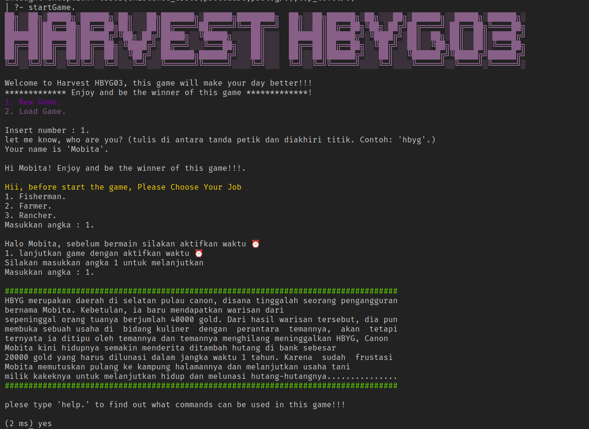

# Harvest HBYG

### IF2121 Logika Komputasional

Harvest HBYG adalah sebuah game berbasis Role-Player dimana user dapat memilih role yang mereka inginkan lalu melakukan banyak kegiatan seperti fishing, ranching, dan harvest untuk mendapatkan gold.

Game akan selesai saat user berhasil mengumpulkan 20000 Gold.

Project ini dibuat oleh Kelompok 6 K-03 IF2121 Logika Komputasional "Canon HBYG03"

Anggota Kelompok:

- Bayu Samudra 13520128
- Febryola Kurnia Putri 13520140
- Aloysius Gilang Pramudya 13520147
- Hilda Carissa Widelia 13520164

## Table of Contents

- [Harvest HBYG](#harvest-hbyg)
  - [Table of Contents](#table-of-contents)
  - [Screenshoot](#screenshoot)
  - [General Information](#general-information)
  - [Features](#features)
  - [Setup](#setup)
    - [Spesifikasi](#spesifikasi)
    - [Cara Setup](#cara-setup)
  - [Usage](#usage)
  - [Room for Improvement](#room-for-improvement)
  - [Acknowledgements](#acknowledgements)
  - [Contact Us](#contact-us)

## Screenshoot



## General Information

- Program ini dibuat dengan menggunakan bahasa prolog dengan materi dari kuliah IF2121 Logika Komputasional
- Kami membuat game ini dengan tujuan untuk menyelesaikan tugas besar IF2121 Logika Komputasional
- Game ini dapat dijalankan di windows dan linux

## Features

Beberapa contoh kegiatan yang dapat dilakukan di dalam game

- Ranching (Memelihara dan mengambil produk hewan-hewan ternak)
- Fishing (Memancing ikan)
- Farming (Menanam dan mengambil hasil tanam)
- Market (untuk menjual dan membeli barang)
- Mengambil Quest
- Mengakses house (untuk tidur dan menulis diary)

## Setup

### Spesifikasi

1. GNU Prolog (Windows GUI program or Linux CLI program)
2. GNU Prolog compiler (gplc, Linux CLI program)

### Cara Setup

> **Notes:** Disarankan untuk menggunakan Windows Terminal ataupun menggunakan
> Gnome Terminal untuk hasil yang terbaik.

1. Clone repository github ini 'https://github.com/bayusamudra5502/Tubes-Logkom.git'
2. Jalankan perintah berikut pada terminal anda:

```bash
prolog
```

3. Jalankan perintah berikut saat telah masuk ke dalam prolog:

```prolog
consult('src/main.pl').
startGame.
```

4. Selamat bermain :D

## Usage

- Untuk memulai game, setelah compile main masukkan command startGame.
- Ketik 1 untuk new game, 2 untuk load game
- Masukkan Username
- Pilih job
- ketik 1 untuk mengaktifkan time
- Untuk melihat commmand apa saja yang dapat dituliskan, bisa ketik help
- Untuk mengakses ranching, market, house, quest, dan alchemist, user harus berpindah dengan command move (w, a, s, d) hingga ke tile yang sesuai baru ketik command yang diinginkan.
- Untuk mengakses fishing, user dapat berpindah ke sekitar tile air kemudian mengetikkan command fish
- Untuk bercocok tanam, user dapat mengakses tile manapun selain yang ada tempat lain kemudian mengetikkan command dig untuk menggali tanah, plant untuk menanam seed, dan harvest untuk memanen jika sudah tumbuh dan berbuah.

## Room for Improvement

Masih banyak kekurangan yang kami miliki dalam pembuatan program ini. Beberapa hal yang dapat ditingkatkan untuk pengembangan program ini :

1. Message-message output dapat lebih dihias agar terlihat lebih menarik
2. Harga-harga bisa lebih disesuaikan agar user tidak terlalu mudah / sulit untuk memenangkan game
3. Penambahan sistem seperti pemberian makan pada hewan di ranching atau penyembelihan hewan agar produk dari ranching bisa lebih banyak seperti daging hewan

## Acknowledgements

Kami berterimakasih kepada :

1. Dosen-dosen dan asisten dosen IF2121 Logika Komputasional,
2. Orang tua yang telah membiayai kami untuk dapat berkuliah di ITB,
3. Keluarga serta kerabat dekat yang selalu mendukung kami,
4. Repository kakak-kakak tingkat informatika angkatan 2019, 2018 dan atasnya, terimakasih karena sudah memberi kami referensi utama dalam mengerjakan tugas besar ini,
5. Teman-teman seperjuangan yang bersama dengan kami melewati lautan tubes dan ujian di Semester 3 tahun 2021 ini, dan
6. Anggota kelompok kami, yang sudah bersama-sama mengerjakan tubes ini, bersama-sama debugging (20 jam++ bersama men-_debug_ di google meet) hingga ditemukan errornya (karena prolog tidak menyatakan kesalahan dalam program).

## Contact Us

- [Bayu Samudra](https://github.com/bayusamudra5502)
- [Febryola Kurnia Putri](https://github.com/febryola)
- [Aloysius Gilang Pramudya](https://github.com/Aloysiusgilang)
- [Hilda Carissa Widelia](https://github.com/bayusamudra5502)
